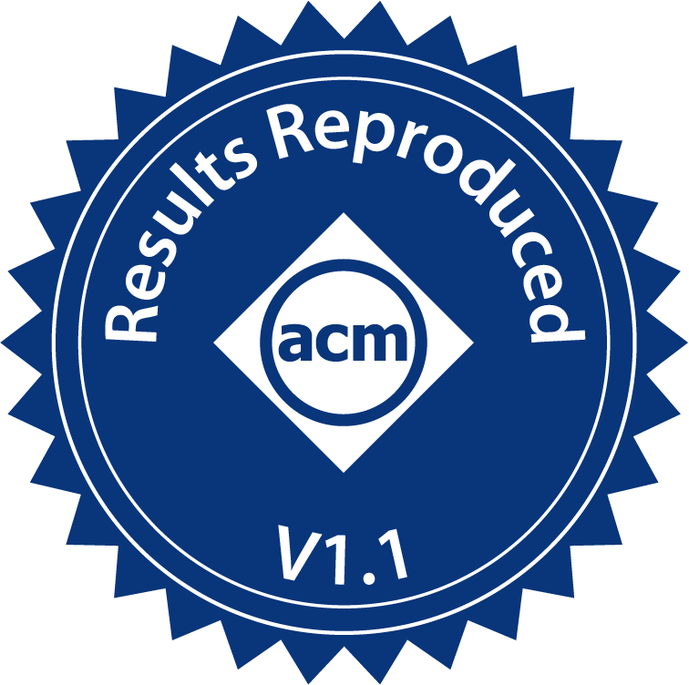
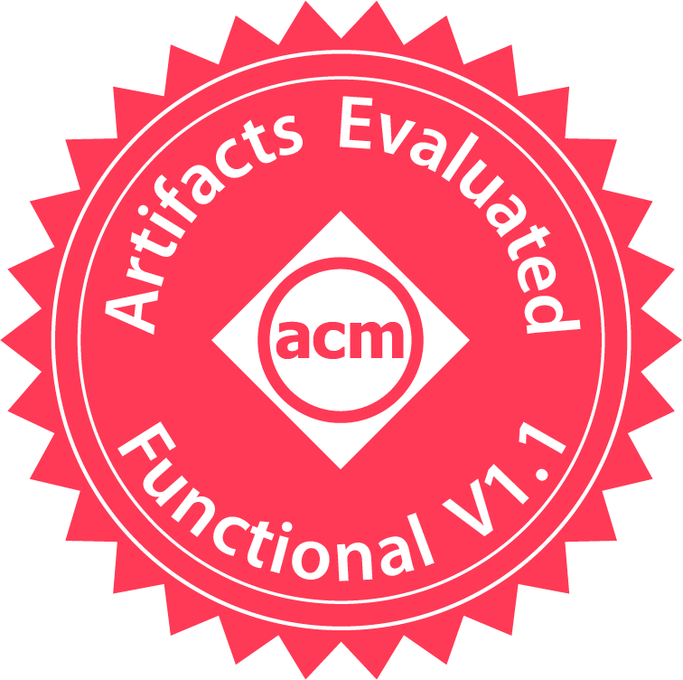

# Characterizing Distributed Mobile Augmented Reality Applications at the Edge

This is the artifacts repository of the CoNEXT 2023 paper: Characterizing Distributed Mobile Augmented Reality Applications at the Edge

## 📖 Abstract
Mobile Augmented Reality (AR) is gaining traction as a compelling application due to recent advancements in hardware and software. Previous studies have suggested that distributing AR services on an edge computing infrastructure can offer significant performance benefits, especially for consolidating concurrent clients. In this study, we shed light on several research challenges directly impact- ing the effective integration of distributed AR and edge computing. Specifically, we conduct extensive experiments by deploying our distributed stream processing-based AR pipeline, scAtteR, on a representative edge-cloud infrastructure managed by the Oakestra framework. We uncover several unapparent challenges that inhibit the effective marriage of distributed AR when deployed on edge and demonstrate the potential improvements through scAtteR++. We offer valuable insights and best practices to the growing AR re- search community, specifically those interested in leveraging edge and public cloud technologies for large-scale AR operations.

## 📝 Reference 
```
@inproceedings{10.1145/3624354.3630584,
	author = {Bartolomeo, Giovanni and Cao, Jacky and Su, Xiang and Mohan, Nitinder}, 
	title = {Characterizing Distributed Mobile Augmented Reality Applications at the Edge}, 
	year = {2023}, 
	isbn = {9798400704079}, 
	publisher = {Association for Computing Machinery}, 
	address = {New York, NY, USA}, 
	url = {https://doi.org/10.1145/3624354.3630584}, 
	doi = {10.1145/3624354.3630584}, 
	booktitle = {Companion of the 19th International Conference on Emerging Networking EXperiments and Technologies}, 
	pages = {9–18}, 
	numpages = {10}, 
	keywords = {distributed stream processing, containers, edge computing, orchestration, Augmented reality}, 
	location = {, Paris, France, }, 
	series = {CoNEXT 2023} 
}
```

## 🛠️ Repository Structure
```
/
├── 🔗scAtteR 
├── 🔗scAtteR++ 
├── 🔗Active-Internal-Queue (Sidecar Queue Component)
├── /graphing
│		├── data
│ 		├── graphs.ipynb
│		├── processing.ipynb
│		└── README.md
├── /experiments
│		├── fig2
│		├── fig3
│		├── fig6
│		├── fig7
│		├── automation
│		└── README.md
└── README.md 			 

```

## 🖼️ Container Images

- scAtter `ghcr.io/cao-jacky/ar_server:20230125_1348`
- scAtteR++ `ghcr.io/giobart/arpipeline:latest`
- Active-Internal-Queue sidecar base 
	- cuda12 compatible `ghcr.io/giobart/active-internal-queue/active-sidecar-queue:v1.0.10-cuda12` 
	- ubuntu22 `ghcr.io/giobart/active-internal-queue/active-sidecar-queue:v1.0.10-ubuntu22` 

