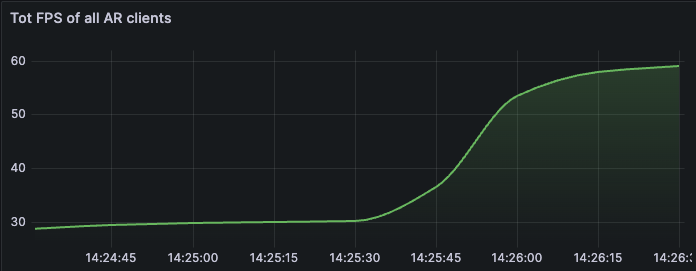

# Deployment Instructions for Experiment Replication

## Pre-requisites

**⚠️  For artifact evaluation committee we provide remote access to a running Oakestra cluster satisfying these requirements ⚠️**

- Runing [Oakestra](oakestra.io) Cluster, (Wiki available at [Oakestra Wiki](https://www.oakestra.io/docs/)
- At least 1 cluster with at least 1 amd64 GPU capable node.  

## Deployment Procedure
1) using Google Chrome, open in one browser tab the Oakestra Dashboard and in another tab the Grafana Dashboard. The artifact evaluation committee will receive a document with links and credentials to access a public Oakestra cluster. 

2) Login using your credentials

3) On top right click (+) Add Application 

4) Choose a unique application name and namespace (max 8 chars each) and hit the Add button

5) The new application should appear on the left and side dashboard panel. Now **Double click** the application name and the application panel should appear. 

6) Hit the  button and navigate to the `SLA` tab. 

7) Click on `Select File to Upload` and provide one of the `.yaml` files according to the experiment that needs to be reproduced. 

| File | Experiment Dexription | Paper Figure |
| -------- | -------- | -------- |
| `fig2/E1.yaml` | Deployment scAtteR in E1 | Fig 2 |
| `fig2/E2.yaml` | Deployment scAtteR in E2 | Fig 2 |
| `fig2/C12.yaml` | Deployment scAtteR in E1,E1,E2,E2,E2 | Fig 2 |
| `fig2/C21.yaml` | Deployment scAtteR in E1,E1,E2,E2,E2 | Fig 2 |
| `fig3/scatter.yaml` | Deployment scAtteR managed by orchestrator| Fig 3 |
| `fig6/E1.yaml` | Deployment scAtteR++ in E1 | Fig 6 |
| `fig6/E2.yaml` | Deployment scAtteR++ in E2 | Fig 6 |
| `fig6/C12.yaml` | Deployment scAtteR++ in E1,E1,E2,E2,E2 | Fig 6 |
| `fig6/C21.yaml` | Deployment scAtteR++ in E1,E1,E2,E2,E2 | Fig 6 |
| `fig7/scatterpp.yaml` | Deployment scAtteR++ managed by orchestrator| Fig 7 |

8) Hit the  button. 

**Known Issue** : If you visualize a popup with `File not in the correct format` error, refresh the page and start over from point (5).

9) You should now visualize the pipeline services registered to the platform. Respectively: `sift`,`encoding`,`primary`,`lsh` and `matching`. For reproducibility, you should also see a special service called `client`. This is a containerized client which will be deployed alongside the pipeline. To perform the deployment hit the  button.

10) After few seconds (refresh the page if necessary) each service should appear with a `NODE_SCHEDULED` status. 

By clicking to a service, it should be possible to observe the running instances. Wait until all the instances of all the services are in 🟢`RUNNING` state.

 
 By clicking on a running instance's state, it's possible to monitor the resource consumption.
 
 

Now, the client will run for approximately **5-10 minutes** before stopping. 

**Troubleshooting:** If not all the instances are in 🟢`RUNNING` state and some of them show e.g., `UNDEPLOYED` or `FAILED`, we suggest deleting the application (see point (11) and trigger a full undeployment), waiting for a cooldown of the resources (CPU% and Memory% under normal parameters) and starting over from 3. It's possible that the cluster is not able to allocate the resources because it is still busy with previous experiments cleanup routines. 

11) When satisfied with the results, perform a full undeployment of the application and clean-up of the resources. 

To do so, simply hit the ⚙️ icon near the application name. 

Then hit the  button. 

Monitor the cluster status and before performing the next experiment make sure the cluster resource de-allocation process is finished. Use the Grafana dashboard to make sure the CPU and Memory usage are back into regular parameters **(<5% CPU usage and <12% Memory usage)**.

## Monitor client QoS metrics and Cluster status

For Artifact evaluation on the public Oakestra cluster, the `instance 0` of each client will log FPS and Avg latency in real-time to the Grafana dashboard, together with the cluster resources consumptions advertised by the Cluster Orchestrator. 

From the Grafana Dashboard, it is, therefore possible to monitor the following metrics:

- Total Cluster available memory and memory consumption %
- Total Cluster CPU and GPU usage %
- Total Cluster GPU memory and memory consumption %

### How to monitor the cluster and app status

1) Log in to the Grafana dashboard using the provided credentials and links.

2) Select the `Cluster` dashbaord

3) All the metrics should appear in this panel and should automatically update every 5 seconds.

**N.b.:** Even when scaling up the clients, only the metrics of the instance `0` of the clients will be shown here. In case of client failure or execution terminated, it's necessary to re-deploy the entire experiment.  

## Scaling up the clients

During the experiments, we also performed scaling up and down of the number of clients. It's possible to emulate this behaviour in this testbed by increasing the instances of the client service. 

1) From Oakestra dashboard click on `client` service to show the running instances. 

In this example, we already have 2 instances.

2) Click the dropdown menu  and hit the deploy button to deploy a new instance. 

3) Wait until the load screen completes

4) You should now see the new instance from the instance list

5) From the grafana dashboard, you should slowly notice a change in resource consumption patterns of the cluster and the real-time FPS of the application. 

## Paper automated experiment script

To generate the paper results, we used the automated script `/automation/scatterExperiment.py` and `/automation/scatter++Experiment.py` installed in our private infrastructure. The scripts use the root oakestra APIs to automate the deployment, scaling, and undeployment process. The scripts require full SSH access to the infrastructure and, therefore, a private & self-owned oakestra cluster. 
The script allows the following configurations:

- Automatic client and services scale up and down
- Latency and packet loss customization
- Experiment repetition, and scale, and cool down customization 
- Cluster configuration
- Automated login
- Experiment failure detection
- Experiment time estimation

A full run of the experiments might take up to 10hrs.

The experiment logs generated from these scripts can be found under the `/grpahing/data` directory of this repository. 

